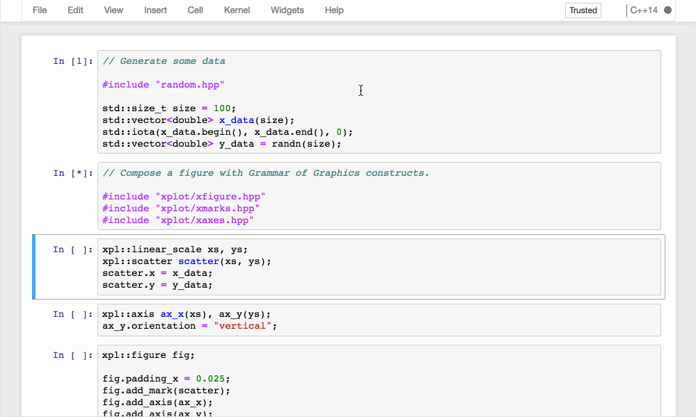

# 

[](https://travis-ci.org/QuantStack/xplot)
[](https://ci.appveyor.com/project/QuantStack/xplot)
[](https://xplot.readthedocs.io/en/latest/?badge=latest)
[](https://mybinder.org/v2/gh/QuantStack/xplot/stable?filepath=notebooks)
[](https://gitter.im/QuantStack/Lobby?utm_source=badge&utm_medium=badge&utm_campaign=pr-badge&utm_content=badge)

C++ backend for the bqplot 2-D plotting library.

**xplot is an early developer preview, and is not suitable for general usage yet. Features and implementation are subject to change.**

## Introduction

`xplot` is a C++ backend for the bqplot 2-D plotting library. It is based upon
the `xwidgets` library, the C++ implementation of the Jupyter interactive
widgets protocol.

`xplot` enables the use of the bqplot 2-D library in the C++ notebook, powered
by the `xeus-cling` kernel and the `cling` C++ interpreter from CERN. `xplot`
can also be used to create applications making use of the Jupyter interactive
widgets without the C++ kernel.

## Installation

We provide a package for the conda package manager.

- Installing `xplot` and the C++ kernel

```bash
conda install xeus-cling xplot -c QuantStack -c conda-forge
```

Then, the front-end extension must be installed for either the classic notebook
or JupyterLab.

- Installing the extensions for the classic notebook

```
conda install widgetsnbextension -c conda-forge
conda install bqplot -c conda-forge
```

- Installing the JupyterLab extension

```
jupyter labextension install @jupyter-widgets/jupyterlab-manager
jupyter labextension install bqplot
```

Or you can directly install it from the sources if you have all the
dependencies already installed:

```bash
cmake -D CMAKE_INSTALL_PREFIX=your_install_prefix
make install
```

## Trying it online

To try out xtensor interactively in your web browser, just click on the binder
link:

[](https://mybinder.org/v2/gh/QuantStack/xplot/stable?filepath=notebooks)

## Documentation

To get started with using `xplot`, check out the full documentation

http://xplot.readthedocs.io/

## Usage



## Dependencies

All the dependencies of xplot are available for the conda package manager.

| `xplot` | `xwidgets`  |  `xeus`         |
|---------|-------------|-----------------|
|  master |   ~0.13.0   |  >=0.13.0,<0.14 |
|  0.9.0  |   ~0.13.0   |  >=0.13.0,<0.14 |
|  0.8.0  |   ~0.12.2   |  >=0.13.0,<0.14 |
|  0.7.0  |   ~0.10.0   |  >=0.12.0,<0.13 |
|  0.6.0  |   ~0.9.0    |  >=0.12.0,<0.13 |
|  0.5.0  |   ~0.8.2    |  >=0.11.0,<0.12 |
|  0.4.1  |   ~0.8.1    |  >=0.11.0,<0.12 |
|  0.4.0  |   ~0.7.1    |  >=0.10.0,<0.11 |
|  0.3.0  |   ~0.6.0    |  >=0.8.0,<0.9   |
|  0.2.0  |   ~0.5.0    |  >=0.8.0,<0.9   |
|  0.1.0  |   ~0.4.0    |  >=0.7.0,<0.8   |

## License

We use a shared copyright model that enables all contributors to maintain the
copyright on their contributions.

This software is licensed under the BSD-3-Clause license. See the [LICENSE](LICENSE) file for details.
